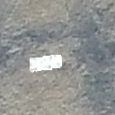
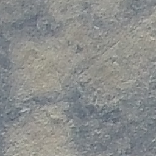
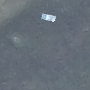
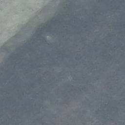
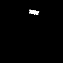

# Augmentation

### [src_rotate_resize_to_targets.py](src_rotate_resize_to_targets.py)
| Input Sources/Targets                                                                                                | Overlaid Images                                                                                                                   |
|----------------------------------------------------------------------------------------------------------------------|-----------------------------------------------------------------------------------------------------------------------------------|
|           |       |
|           |  |
|  |       |
|  |  |
