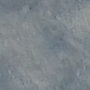
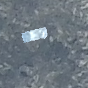
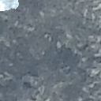

# Augmentation

### [rotate_resize_crop.py](rotate_resize_crop.py)
| Input Image                                                                                                     | 30° width 40 α 215 |
|-----------------------------------------------------------------------------------------------------------------|--|
|  |   |

### [adjust_overlay.py](adjust_overlay.py)
| Input Images                                                                                               | Overlaid Images                                                                                          |
|------------------------------------------------------------------------------------------------------------|----------------------------------------------------------------------------------------------------------|
|       |  |
|  |  |

